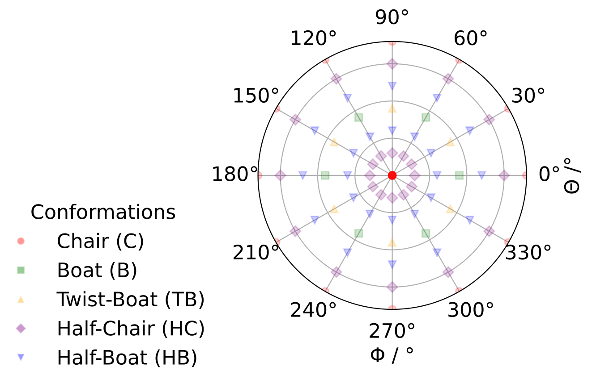

# Ring Puckering Analysis

This analysis tool is specifically designed for the conformational analysis of 6-membered rings. It provides specialized tools for analyzing the puckering parameters starting from .xyz files.
The tools for the analysis were used in the article: "The role of non-covalent interaction in the chirality of diketopiperazine peptides with identical residues: a theoretical approach".

## Overview

This analysis characterizes 6-membered rings (in our case cyclic dipeptides, DKPs) by computing the spherical polar set from the Cremer-Pople coordinates.

- **Total puckering amplitude (Q)**: Overall degree of ring puckering
- **Spherical polar coordinates (θ, φ)**: Angular parameters describing puckering geometry. $\theta$ is the polar angle ($0 \leq \theta \leq \pi$ ) and $\phi$ is the azimuthal one ($0 \leq \phi \leq \mathrm{2}\pi$). 
- **Conformation classification**: Assignment to standard ring conformations (Chair, Boat, Twist-Boat, etc.) is performed following:
C. Haasnoot, “The conformation of six-membered rings described by puckering coordinates derived from endocyclic torsion angles,” Journal of the American Chemical Society 114, 882–887 (1992).

## Features

- **XYZ file parsing**: Reads molecular coordinates from standard XYZ format files
- **User-defined ring detection**: Uses predefined atom indices to extract the atom rings.
- **Puckering parameter calculation**: Computes Cremer-Pople puckering coordinates and the Spherical Polar Set.
- **Conformation assignment**: Classifies rings into standard conformational categories, according to the minimum spherical (haversine) distance from the given standard conformation.
- **Data visualization**: Generates histograms and polar plots of puckering distributions.

## Supported Systems

The following cyclic dipeptide systems are supported with predefined ring atom indices:

- `cGlyGly` - Cyclo(Gly-Gly)
- `cAlaAla` - Cyclo(Ala-Ala) 
- `cHisHis` - Cyclo(His-His)
- `cHisHis2+` - Cyclo(His-His) doubly protonated
- `cPhgPhg` - Cyclo(Phg-Phg)
- `cLeuLeu` - Cyclo(Leu-Leu)
- `cValVal` - Cyclo(Val-Val)
- `cTrpTrp` - Cyclo(Trp-Trp)
- `cPhePhe` - Cyclo(Phe-Phe)

## Installation

Ensure you have the required Python packages installed:

```bash
pip install numpy pandas matplotlib pathlib
```

## Usage

### Basic Usage

Run the analysis from the command line:

```bash
python main.py <path_to_data_directory>
```

Example:
```bash
python main.py data
```

### Expected Directory Structure

Your data directory should be organized as follows:

```
data/
├── SS/
│   ├── cAlaAla/
│   │   └── structure.xyz
│   ├── cGlyGly/
│   │   └── structure.xyz
│   └── ...
└── SR/
    ├── cAlaAla/
    │   └── structure.xyz
    ├── cGlyGly/
    │   └── structure.xyz
    └── ...
```

Where:
- `SS/` and `SR/` represent different chiralities
- Each system folder contains XYZ coordinate files
- XYZ files should follow standard format (atom count, comment line, then atomic coordinates)

### Output

The analysis generates:

1. **JSON data file** (`output/puckering_data.json`): Contains all computed puckering parameters
2. **Summary plot** (`output/puckering_summary.pdf`): Visualization showing:
   - Histogram of puckering amplitudes
   - Polar plot of conformational distribution

## Core Functions

### `ring_analysis.py`

#### Key Functions:

- `parse_xyz_to_df(file_path)`: Parses XYZ files into pandas DataFrames
- `get_pucker_values(df, system_name)`: Computes all puckering parameters for a structure
- `get_ring_pucker_coords(coordinates)`: Calculates Cremer-Pople puckering coordinates
- `get_spherical_polar_set_n6(amplitude,angle_deg)`: Computed the Spherical Polar Set from the Cremer-Pople puckering coordinates
- `conformation_haversine(amplitude, theta_deg, phi_deg)`: Assigns conformations
- `analyze_system(system_folder)`: Batch processes all structures in a directory

#### Ring Conformations:

The script classifies rings into the following conformations based on θ and φ angles, as in C. Haasnoot, “The conformation of six-membered rings described by puckering coordinates derived from endocyclic torsion angles,” Journal of the American Chemical Society 114, 882–887 (1992).

- **Chair (C)**: θ ≈ 0° or 180°
- **Boat (B)**: θ ≈ 90°, φ = 0°, 60°, 120°, 180°, 240°, 300°
- **Twist-Boat (TB)**: θ ≈ 90°, φ = 30°, 90°, 150°, 210°, 270°, 330°
- **Half-Chair (HC)**: θ ≈ 30° or 150°
- **Half-Boat (HB)**: θ ≈ 60° or 120°



*Figure: Polar coordinate representation showing the angular regions corresponding to different ring conformations. The radial axis represents θ (0° to 180°) and the angular axis represents φ (0° to 360°). Different markers indicate the canonical positions for each conformation type.*

### `plotting.py`

Generates plots including:
- Puckering amplitude histograms
- Polar coordinate conformational maps
- Reference conformational markers


## Error Handling

The script includes robust error handling for:
- Missing or invalid XYZ files
- Unsupported system names
- Invalid coordinate data
- File I/O errors

## References

- Cremer, D. & Pople, J. A. (1975). General definition of ring puckering coordinates. *J. Am. Chem. Soc.*, 97, 1354-1358.
- Boeyens, J. C. A. (1978). The conformation of six-membered rings. *J. Cryst. Mol. Struct.*, 8, 317-320.
- C. Haasnoot, “The conformation of six-membered rings described by puckering coordinates derived from endocyclic torsion angles,” Journal of the American Chemical Society 114, 882–887 (1992).
- Chan, Lucian, Geoffrey R. Hutchison, and Garrett M. Morris. "Understanding ring puckering in small molecules and cyclic peptides." Journal of Chemical Information and Modeling 61.2 (2021): 743-755.

## Acknowledgments

Parts of the code in this repository are adapted from:  
https://github.com/lucianlschan/RING – *Ring puckering analysis in small molecules and cyclic peptides* by Lucian Chan et al.

We acknowledge the original authors for providing the foundation for ring puckering analysis. Modifications and extensions have been made to integrate conformation assignment and visualization features.


## License

This software is provided as-is for research purposes.
